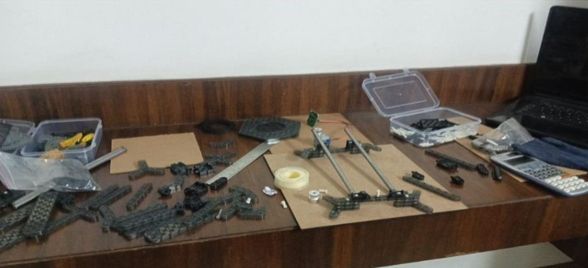
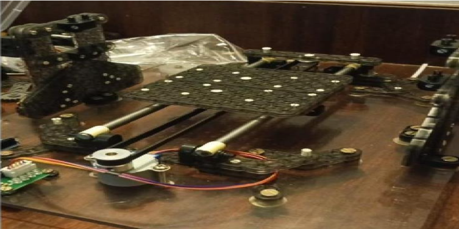
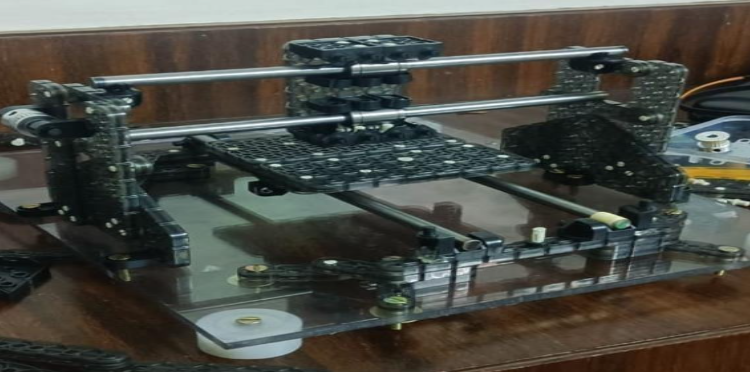
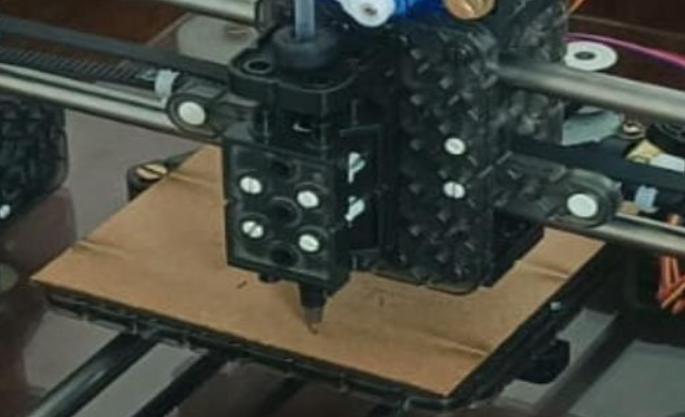
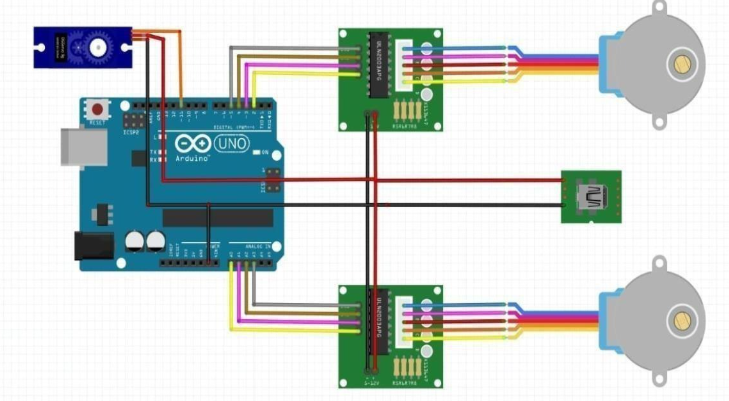
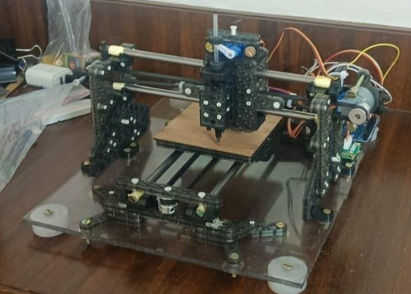

# CNC Braille Embossing Prototype

## Overview
A low-cost CNC-based system designed to emboss Braille text onto flat surfaces using Arduino-controlled stepper motors and G-code motion control. The system translates text input into precise dot patterns that meet standard Braille spacing and readability requirements, making Braille signage production accessible and affordable for schools, hospitals, and public institutions.

## How It Works
- Text is converted to G-code using Inkscape software
- G-code is sent to the Arduino via the GCTRL Processing program
- Arduino mounted on CNC shield distributes commands to stepper drivers
- Stepper motors control X and Y axis movement across the work surface
- Servo motor controls Z axis for embossing force
- Embossing tool presses raised dots onto the surface in precise Braille dot patterns

## My Contribution
This is my personal project. I designed and built the full system including:

- Assembled the CNC frame from repurposed DVD/CD ROM stepper motors and rails
- Integrated X, Y, and Z axis stepper motors with lead screws
- Set up and tested the L293D motor driver circuit
- Calibrated motion and validated Braille dot alignment against standard Braille spacing
- Programmed Arduino firmware for G-code interpretation and motor control
- Validated output through user testing confirming consistent and readable Braille dots

## System Architecture
Text Input → Inkscape (G-code) → GCTRL Processing → Arduino UNO
→ CNC Shield → Stepper Drivers → Stepper Motors (X, Y, Z axes)
→ Embossing Tool → Braille Output

## Prototype Images

### Full Assembly

### Axis Mechanisms
**X-Axis**

**Y-Axis**

**Z-Axis / Embossing Mechanism**

### Circuit Setup

### Braille Output

## Demo Video
Watch the prototype in action:
https://drive.google.com/file/d/1zKEh2IA8vTBwCATfsi03S3RSVAxq3Uvj/view?usp=drivesdk

## Technologies Used
- Arduino Uno(ATmega328P)
- Stepper motors with lead screws (repurposed from DVD/CD ROM drives)
- Servo motor (Z-axis embossing control)
- L293D motor driver IC
- CNC motion control
- G-code motion control
- Inkscape 0.48.5 for G-code generation
- Processing 2.2.1 (GCTRL program) for serial communication

## Specifications
- Working area: 4cm x 4cm embossing surface
- Axes: X, Y (stepper motors), Z (servo motor)
- Motion resolution: Stepper motor with lead screw for precise dot positioning
- Dot compliance: Meets standard Braille dot spacing requirements
- Power supply: 5V via USB (Arduino), external supply for stepper motors

## Applications
- Braille signage for schools, hospitals and public spaces
- Educational Braille learning materials for visually impaired students
- Tactile labels for elevators, doors, and public utilities
- Low-cost assistive technology for NGOs and rehabilitation centres
- Inclusive product labelling

## Future Improvements
- Dedicated force-feedback Z-axis for consistent embossing depth
- Automatic text-to-Braille conversion software interface
- Higher precision linear guides for improved positioning accuracy
- Wireless/IoT connectivity for remote operation
- Vision-based automatic calibration system
